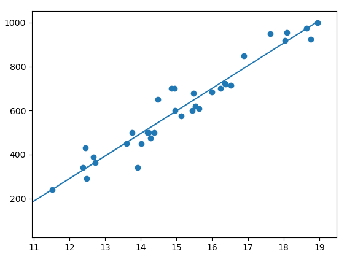

# Linear Regression
With python and without an incremental algorithm this time

Fits a best fit line to a dataset of fish height vs weight from [Aung Pyae](https://www.kaggle.com/aungpyaeap/fish-market/data)

This is computed by solving a system of linear equations given by

set to zero, so as to find the minimum of the cost function J,

where xi and yi denote the ith fish height and weight, respectively, not exponentiation.
resulting in the following system

The solution of this system results a vector of thetas that fits a linear hypothesis function to the dataset of fish heights and weights, corresponding to the function

which, in the context of this dataset, suggests an increase in weight of about 100 grams for every centimeter increase in height of Bream
